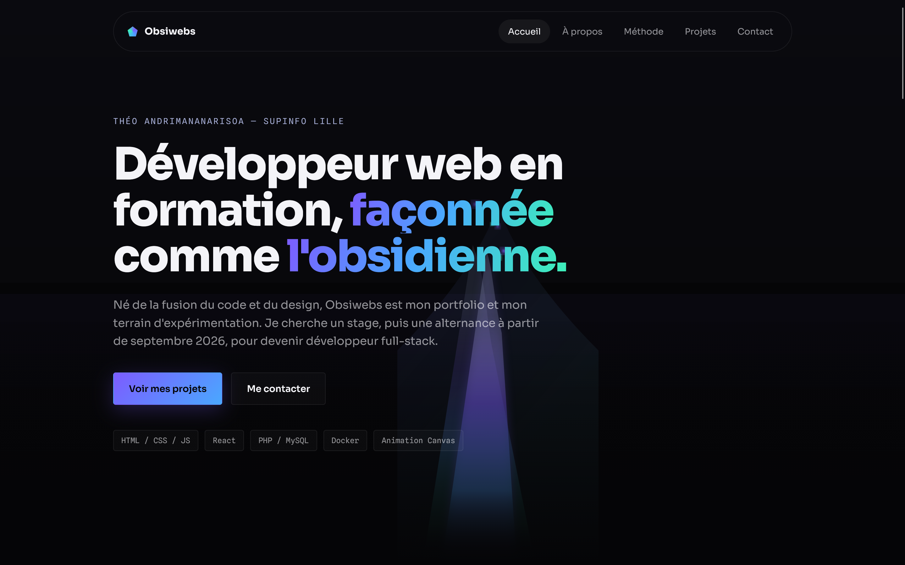

# Obsiwebs — Portfolio V2

> **Théo Andrimananarisoa** · Développeur web en formation · SUPINFO Lille  
> Recherche stage (2 mois min.) puis alternance à partir de septembre 2026

[](https://www.obsiwebs.com)
[](https://www.linkedin.com/in/théo-andrimananarisoa-a64973395/)
[](https://github.com/the0b51d14n)

---



---

## À propos

Portfolio personnel V2, refonte complète de la V1. Direction artistique **obsidienne** : noir profond, irisations froides violet/vert/bleu, typographie nette, animations canvas maison.

Conçu et codé à Lille — chaque choix technique est documenté, chaque composant réfléchi avant d'être écrit.

---

## Stack technique

| Couche | Technologie |
|---|---|
| Framework | React 18 |
| Bundler | Vite 5 |
| Styles | CSS vanilla (variables, animations) |
| Icônes | Lucide React |
| Animation hero | Canvas 2D (moteur maison) |
| Formulaire | Web3Forms + filtre anti-spam Strict |
| Déploiement | Vercel |
| Domaine | OVH Cloud |

---

## Projets présentés

### Supinfo.TV V2
Plateforme VOD développée en projet d'école. PHP / MySQL / Docker / API TMDB.  
Premier contact avec le back-end et la conteneurisation, appris en autonomie.  
→ [Dépôt GitHub](https://github.com/the0b51d14n/Supinfo.TV-V2)

### Au Trés'Or des Sens
Site vitrine pour une vraie cliente — entreprise de massages à domicile.  
HTML / CSS / JS. Direction artistique douce et chaleureuse, à l'opposé de mon style habituel.  
Première expérience de la relation client.  
→ Mise en ligne prévue

### Obsiwebs — Portfolio
Ce portfolio lui-même, V1 → V2. React / Vite / Canvas 2D.  
Leçon principale : savoir reprendre son propre travail d'un œil critique.  
→ [www.obsiwebs.com](https://the0b51d14n.github.io/obsiwebs/)

---

## Lancer en local

```bash
# Cloner le repo
git clone https://github.com/the0b51d14n/obsiwebs-V2.git
cd obsiwebs-V2

# Installer les dépendances
npm install

# Lancer le serveur de développement
npm run dev
```

Le site est accessible sur `http://localhost:5173`.

```bash
# Build de production
npm run build

# Prévisualiser le build
npm run preview
```

---

## Structure du projet

```
obsiwebs-V2/
├── public/
│   ├── assets/          # Captures des projets
│   ├── android-chrome-192x192.png  # Logo / blason
│   └── favicon.ico
├── src/
│   ├── components/      # Nav, Hero, About, Process, ProjectCarousel, Contact, Footer
│   ├── data/
│   │   └── projects.js  # Contenu des fiches projets
│   ├── App.jsx
│   ├── index.css        # DA complète + variables CSS
│   └── main.jsx
├── index.html
├── vite.config.js
└── package.json
```

---

## Contact

- **Email** : [theo.supinfo@gmail.com](mailto:theo.supinfo@gmail.com)
- **LinkedIn** : [Théo Andrimananarisoa](https://www.linkedin.com/in/théo-andrimananarisoa-a64973395/)
- **Instagram** : [@obsiwebs](https://www.instagram.com/obsiwebs/)

---

<p align="center">
  Design & code — Obsiwebs · © 2026 Théo Andrimananarisoa
</p>